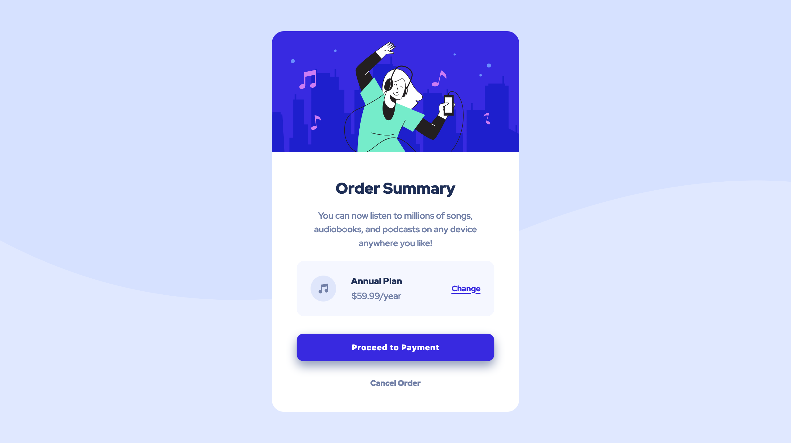

# Frontend Mentor - Order summary card solution

This is a solution to the [Order summary card challenge on Frontend Mentor](https://www.frontendmentor.io/challenges/order-summary-component-QlPmajDUj). Frontend Mentor challenges help you improve your coding skills by building realistic projects. 

&nbsp;  
## Table of contents

- [Overview](#overview)
  - [The challenge](#the-challenge)
  - [Screenshot](#screenshot)
  - [Links](#links)
- [My process](#my-process)
  - [Built with](#built-with)
  - [What I learned](#what-i-learned)
  - [Continued development](#continued-development)
- [Author](#author)

&nbsp;  
## Overview

### The challenge

Users should be able to:

- See hover states for interactive elements
- Have a pleasant experience on both phone and computer

&nbsp;  
### Screenshot

&nbsp;  
### Links

- Solution URL: (https://github.com/JakeHand/order-summary-component)
- Live Site URL: (https://jakehand.github.io/order-summary-component/)

&nbsp;  
## My process

### Built with

- Semantic HTML5 markup
- CSS custom properties
- Flexbox
- CSS Grid
- Mobile-first workflow

&nbsp;  
### What I learned

This project served as more practice to my grid and flexbox knowledge, and general HTML and CSS mastery. I am becoming much more conscious of the tidiness of my code, and how to make it easier for others and myself to read. 

&nbsp;  
### Continued development

I look forward to continuing to practice my HTML and CSS as they proceed to become more intuitive to me, and paying more attention to my code and the way I am writing it.

&nbsp;  
## Author

I am looking for a remote front end developer job. Contact me via email below.

- Email - jakehandp@gmail.com
- GitHub - [JakeHand](https://github.com/JakeHand)
- Frontend Mentor - [@JakeHand](https://www.frontendmentor.io/profile/JakeHand)